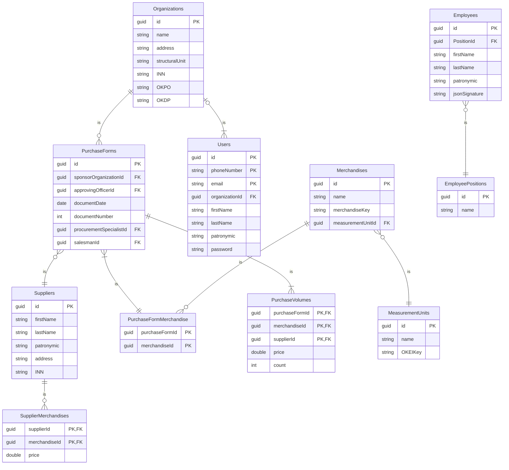

# PurchaseForm
Автоматизатор заполнения закупочного акта ресторана

## Схема базы данных

guid - уникальный идентификатор

## Роли пользователей
|   Роль    |                               Права                                     |
|-----------|-------------------------------------------------------------------------|
| Бухгалтер организации | Чтение товаров продавцов, чтение закупочных актов организации, создание, редактирование и удаление закупочных актов|
| Администратор организации | Чтение товаров продавцов, чтение закупочных актов организации, редактирование, удаление организации |
| Продавец | Чтение своих товаров и товаров других продавцов, чтение закупочных актов в которых он участвует|